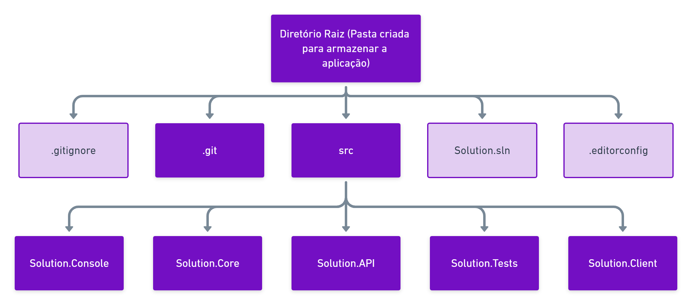
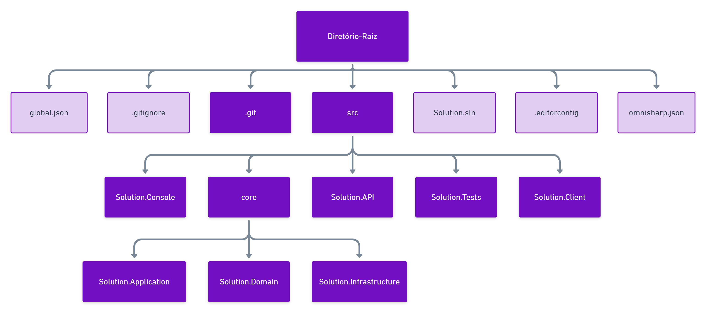

# Estrurando o seu projeto .NET

## 🔤 Introdução

De acordo com a documentação oficial da Microsoft, **.NET** é *uma plataforma de desenvolvedor gratuita, multiplataforma e de software livre para a criação de muitos diferentes tipos de aplicativos. Com o .NET, você pode usar várias linguagens, editores e bibliotecas para criação para Web, dispositivo móvel, desktop, jogos e IoT.* 

Todas essas possibilidades trazidas por ela, desde linguagens e runtimes até bibliotecas e frameworks nos permitem estruturar projetos e construir nossas aplicações de maneira muito versátil. Porém, existem práticas, padrões e estilos de código que são comuns entre a comunidade de desenvolvimento e que são incentivados pela principal mantendedora da plataforma, A Microsoft.

Este projeto tem como a intenção de documentar e direcionar a estruturação de qualquer projeto com .NET, seguindo as principais práticas da comunidade juntamente alinhadas com recursos e documentações oficiais. 

Para isso, precisamos entender alguns conceitos, arquivos e configurações que podem compor o nosso projeto. Neste documento e projeto utilizaremos o .NET 5, última versão estável do SDK lançada até o momento, Visual Studio Code, um editor de código open-source amplamente difundido na comunidade e o *Command-Line Interface (CLI)* do .NET, o `dotnet`. Se você não utiliza o Visual Studio Code não se preocupe, seu projeto poderá ser utilizado em qualquer IDE ou editor de código.

Os principais comandos da estruturação do projeto serão executados em algum terminal de linha de comando, que podem ser o *CMD*, *Powershell*, *Bash*, *Zsh*, *Fish* entre muitos outros.

## 🏁 Por onde começar?

Para iniciarmos devemos entender os conceitos de **projeto** e **solução**.

#### Projeto

Os **projetos** armazenam os itens necessários para criação da aplicação, como arquivos de código-fonte, bitmaps, ícones e referências de componente e serviço. 

O .NET nos forncece modelos conhecidos como *templates*, que trazem arquivos e configurações básicas para o tipo de projeto que eles representam. Por exemplo, para um aplicativo de linha de comando temos o *template* `console`, para API's Web temos o `webapi`, para Blazor temos o `blazorwasm` ou `blazorserver` e para bibliotecas de classe temos o `classlib`. 

A comunidade também tem os próprios templates e distribuem na maioria das vezes através da **Nuget Gallery**.

#### Solução

De acordo com documentação da Microsoft, temos que uma **solução** é ***um contêiner usado para organizar um ou mais projetos de código relacionados***, por exemplo, um projeto de biblioteca de classes e um projeto de teste correspondente. 

A solução representa toda a nossa aplicação que pode conter diversas partes (projetos) mas que no final compõe o todo que é o objetivo da aplicação.

> Caso tenha em mente utilizar um único projeto não é necessário o uso de soluções, apesar de ser recomendado. Isso se dá devido a possibilidade de compilar e executar um projeto sem necessariamente haver uma solução. 

O uso da solução é necessária para que que o editor ou IDE consiga enxergar e carregar esses projetos caso eles tenham ou não relação. Um exemplo comum é o caso de termos uma API REST e um *client-side* como Blazor, projetos que podem não compartilhar interações entre suas classes, mas que pertencem a uma mesma aplicação.

A solução ainda tem mais algumas características interessantes, que podem ser consultadas clicando [aqui]().

Entendendo os conceitos sobre projetos e soluções podemos pensar assim na estrutura de pastas que utilizaremos.

## 📂 Estrutura de Pastas

Vimos que uma aplicação .NET pode ser composta ou não de vários projetos, mas é possível utilizar este padrão de organização para os dois casos.

O nosso primeiro é criar uma pasta que armazenará o todo o código-fonte, arquivos de configuração, imagens, entre muitos outros. Esse diretório é o nosso **diretório-raiz**. 

O arquivo de solução está contido nesse diretório juntamente com outros arquivos como a pasta do Git, o arquivo gitignore e outros arquivos de **configuração global** da nossa aplicação.

Dentro do nosso diretório-raiz criamos outra pasta chamada **src**, responsável por agrupar as pastas e arquivos referentes a todos os projetos, como exemplificado na imagem abaixo, a qual temos as pastas na cor roxa e os arquivos (que falaremos um pouco mais a frente) na cor mais clara.

 
  

Esta é uma estrutura simples e clara, que facilita a organização da aplicação e separa escopos, como por exemplo, configurações específicas de cada projeto e configurações globais. Caso o Core do seu projeto tenha múltiplos projetos pode-se usar uma estrutura similar, como esta:

 
  

Vale ressaltar que estas estruturas podem variar a depender do projeto, empresa ou comunidade em que está contribuindo. A intenção realmente é "dar um norte" na organização de projetos .NET.

## 🛠️ Configurações Globais

Nas imagens acima, podemos observar alguns arquivos que estão no diretório raiz do nosso projeto. Se você já criou/utilizou algum repositório Git, verá que alguns desses arquivos são comuns, como o `.gitignore`. No entanto uma aplicação C# pode contar diversos outros arquivos que irão auxiliá-los na melhor experiência e padronização da aplicação. 

### global.json

De acordo com a documentação da Microsoft, temos que o `global.json` é um arquivo que permite que você defina qual versão do SDK do .NET é usada quando você executa comandos da CLI do .NET. 

Essa definição também é herdada por editores/IDE's e facilitam na hora hora de definir qual a versão-base do projeto e quais versões poderão ser utilizadas nele.

Esse arquivo nos permite definir que todos desenvolverem o projeto juntamente conosco utilizem a mesma versão e assim evitem conflitos de recursos não disponíveis entre as versões. Além disso você também pode definir quais versões de atualização do SDK são suportadas pelo seu projeto, tornando o ambiente de desenvolvimento mais coeso.

Para utilizá-lo basta executar no comando `dotnet new globaljson` no diretório raiz do seu projeto. Caso deseja compreender como configurá-lo, sugiro que consulte a documentação oficial, clicando [aqui](https://docs.microsoft.com/pt-br/dotnet/core/tools/global-json?tabs=netcore3x).

### omnisharp.json (opcional)

Se você utiliza o Visual Studio Code e extensão do C#, esta configuração pode ser útil a você. O **OmniSharp** é um conjunto de projetos *open-source* que trabalham juntos para trazer o desenvolvimento .NET para qualquer editor de texto.

A camada base é um servidor que executa o **Roslyn**, um analizador de código-fonte desenvolvido para o .NET, que analisa os arquivos do projeto que estão abertos dentro do editor.

Em consonância a isso, temos que o `omnisharp.json` é o arquivo de configuração do OmniSharp. Ele é um conjunto de opções de configuração que podem ser usadas para modificar o comportamento do OmniSharp em relação a:

 - Configurações de projeto (MSBuild, CSX entre outros);
 - opções de formatação de código;
 - Opções de extensões Roslyn;
 - opções de inclusão e exclusão de arquivos a serem analizados;

 Utilizá-lo pode garantir um melhor uso dos recursos do teu projeto, aprimorar o seu código e definir o seu estilo. Por exemplo, excluir pastas como a `bin` ou `obj` nas configurações do seu omnisharp pode incrementar a performance do analizador, tendo em vista que há menos arquivos para se observar.

 Você pode encontrar as configurações disponíveis clicando [aqui](https://github.com/OmniSharp/omnisharp-roslyn/wiki/Configuration-Options).

### .editorconfig

De acordo com a [documentação oficial](https://editorconfig.org/), o arquivo `.editorconfig` ajuda a manter estilos de codificação consistentes para vários desenvolvedores que trabalham no mesmo projeto em vários editores e IDEs. 

Os arquivos EditorConfig são facilmente legíveis e funcionam bem com sistemas de controle de versão.

Na sua aplicação C# ele pode ser muito útil devido a extensa possibilidade de estilizar o seu código e definir padrões para o projeto, ferramenta que se torna essencial para projetos em equipe.